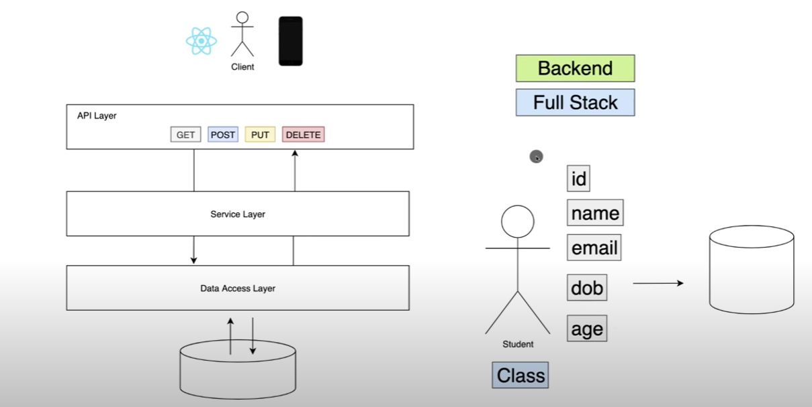

# proyecto de Spring Boot
Proyecto basado en videotutorial de https://amigoscode.com/p/spring-boot
se ven conceptos importantes como API Restful, inyección de dependencia, 
análisis de objetos JSON, solicitudes HTTP POST, GET, PUT y DELETE y más
